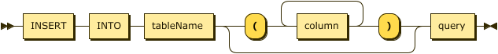

This page describes the SQL dialect recognized by Polypheny-DB's default SQL parser in a [BNF](https://en.wikipedia.org/wiki/Backus%E2%80%93Naur_Form)-like form.

<!---
{::nomarkdown}

<!DOCTYPE html PUBLIC "-//W3C//DTD XHTML 1.0 Transitional//EN" "http://www.w3.org/TR/xhtml1/DTD/xhtml1-transitional.dtd"><html xmlns="http://www.w3.org/1999/xhtml">
   <head>
      <meta http-equiv="Content-Type" content="application/xhtml+xml; charset=UTF-8" />
      <meta name="generator" content="Railroad Diagram Generator 1.63" />
      <svg xmlns="http://www.w3.org/2000/svg">
         <defs>
            
         </defs></svg></head>
   <body>
      <xhtml:p xmlns:xhtml="http://www.w3.org/1999/xhtml" style="font-size: 14px; font-weight:bold"><xhtml:a name="insert">insert:</xhtml:a></xhtml:p><svg xmlns="http://www.w3.org/2000/svg" width="633" height="69">
         <defs>
            
         </defs>
         <polygon points="9 33 1 29 1 37"/>
         <polygon points="17 33 9 29 9 37"/><a xmlns:xlink="http://www.w3.org/1999/xlink" xlink:href="#INSERT" xlink:title="INSERT">
            <rect x="31" y="19" width="64" height="32"/>
            <rect x="29" y="17" width="64" height="32" class="nonterminal"/>
            <text class="nonterminal" x="39" y="37">INSERT</text></a><a xmlns:xlink="http://www.w3.org/1999/xlink" xlink:href="#INTO" xlink:title="INTO">
            <rect x="115" y="19" width="50" height="32"/>
            <rect x="113" y="17" width="50" height="32" class="nonterminal"/>
            <text class="nonterminal" x="123" y="37">INTO</text></a><a xmlns:xlink="http://www.w3.org/1999/xlink" xlink:href="#tableName" xlink:title="tableName">
            <rect x="185" y="19" width="88" height="32"/>
            <rect x="183" y="17" width="88" height="32" class="nonterminal"/>
            <text class="nonterminal" x="193" y="37">tableName</text></a><rect x="313" y="19" width="26" height="32" rx="10"/>
         <rect x="311" y="17" width="26" height="32" class="terminal" rx="10"/>
         <text class="terminal" x="321" y="37">(</text><a xmlns:xlink="http://www.w3.org/1999/xlink" xlink:href="#column" xlink:title="column">
            <rect x="379" y="19" width="64" height="32"/>
            <rect x="377" y="17" width="64" height="32" class="nonterminal"/>
            <text class="nonterminal" x="387" y="37">column</text></a><rect x="483" y="19" width="26" height="32" rx="10"/>
         <rect x="481" y="17" width="26" height="32" class="terminal" rx="10"/>
         <text class="terminal" x="491" y="37">)</text><a xmlns:xlink="http://www.w3.org/1999/xlink" xlink:href="#query" xlink:title="query">
            <rect x="549" y="19" width="56" height="32"/>
            <rect x="547" y="17" width="56" height="32" class="nonterminal"/>
            <text class="nonterminal" x="557" y="37">query</text></a><svg:path xmlns:svg="http://www.w3.org/2000/svg" class="line" d="m17 33 h2 m0 0 h10 m64 0 h10 m0 0 h10 m50 0 h10 m0 0 h10 m88 0 h10 m20 0 h10 m26 0 h10 m20 0 h10 m64 0 h10 m-104 0 l20 0 m-1 0 q-9 0 -9 -10 l0 -12 q0 -10 10 -10 m84 32 l20 0 m-20 0 q10 0 10 -10 l0 -12 q0 -10 -10 -10 m-84 0 h10 m0 0 h74 m20 32 h10 m26 0 h10 m-236 0 h20 m216 0 h20 m-256 0 q10 0 10 10 m236 0 q0 -10 10 -10 m-246 10 v14 m236 0 v-14 m-236 14 q0 10 10 10 m216 0 q10 0 10 -10 m-226 10 h10 m0 0 h206 m20 -34 h10 m56 0 h10 m3 0 h-3"/>
         <polygon points="623 33 631 29 631 37"/>
         <polygon points="623 33 615 29 615 37"/></svg>
   </body>
</html>

<html>
  <head>
    
    
  </head>

  <body>
     

  </body>
</html>

{:/}
--->



<!--- BNF start --->
{::nomarkdown}
<html>

<svg class="railroad-diagram" width="231" height="92" viewBox="0 0 231 92">
<g transform="translate(.5 .5)">
<g>
<path d="M20 21v20m10 -20v20m-10 -10h20"></path>
</g>
<path d="M40 31h10"></path>
<g class="terminal ">
<path d="M50 31h0"></path>
<path d="M95.5 31h0"></path>
<rect x="50" y="20" width="45.5" height="22" rx="10" ry="10"></rect>
<text x="72.75" y="35">foo</text>
</g>
<path d="M95.5 31h10"></path>
<g>
<path d="M105.5 31h0"></path>
<path d="M191 31h0"></path>
<path d="M105.5 31h20"></path>
<g class="terminal ">
<path d="M125.5 31h0"></path>
<path d="M171 31h0"></path>
<rect x="125.5" y="20" width="45.5" height="22" rx="10" ry="10"></rect>
<text x="148.25" y="35">bar</text>
</g>
<path d="M171 31h20"></path>
<path d="M105.5 31a10 10 0 0 1 10 10v10a10 10 0 0 0 10 10"></path>
<g class="terminal ">
<path d="M125.5 61h0"></path>
<path d="M171 61h0"></path>
<rect x="125.5" y="50" width="45.5" height="22" rx="10" ry="10"></rect>
<text x="148.25" y="65">baz</text>
</g>
<path d="M171 61a10 10 0 0 0 10 -10v-10a10 10 0 0 1 10 -10"></path>
</g>
<path d="M 191 31 h 20 m -10 -10 v 20 m 10 -20 v 20"></path>
</g>
</svg>
</html>
{:/}
<!--- BNF end --->

insert:
      INSERT INTO tableName
      [ '(' column [, column ]* ')' ]
      query

update:
      UPDATE tableName
      SET assign [, assign ]*
      [ WHERE booleanExpression ]

assign:
      identifier '=' expression

delete:
      DELETE FROM tableName [ [ AS ] alias ]
      [ WHERE booleanExpression ]

query:
      values
  |   WITH withItem [ , withItem ]* query
  |   {
          select
      |   selectWithoutFrom
      |   query UNION [ ALL | DISTINCT ] query
      |   query EXCEPT [ ALL | DISTINCT ] query
      |   query MINUS [ ALL | DISTINCT ] query
      |   query INTERSECT [ ALL | DISTINCT ] query
      }
      [ ORDER BY orderItem [, orderItem ]* ]
      [ LIMIT { [ start, ] count | ALL } ]
      [ OFFSET start { ROW | ROWS } ]
      [ FETCH { FIRST | NEXT } count { ROW | ROWS } ONLY ]

withItem:
      name
      [ '(' column [, column ]* ')' ]
      AS '(' query ')'

orderItem:
      expression [ ASC | DESC ] [ NULLS FIRST | NULLS LAST ]

select:
      SELECT [ STREAM ] [ ALL | DISTINCT ]
          { *| projectItem [, projectItem ]* }
      FROM tableExpression
      [ WHERE booleanExpression ]
      [ GROUP BY { groupItem [, groupItem ]* } ]
      [ HAVING booleanExpression ]
      [ WINDOW windowName AS windowSpec [, windowName AS windowSpec ]* ]

selectWithoutFrom:
      SELECT [ ALL | DISTINCT ]
          { *| projectItem [, projectItem ]* }

projectItem:
      expression [ [ AS ] columnAlias ]
  |   tableAlias . *

tableExpression:
      tableReference [, tableReference ]*
  |   tableExpression [ NATURAL ] [ ( LEFT | RIGHT | FULL ) [ OUTER ] ] JOIN tableExpression [ joinCondition ]
  |   tableExpression CROSS JOIN tableExpression
  |   tableExpression [ CROSS | OUTER ] APPLY tableExpression

joinCondition:
      ON booleanExpression
  |   USING '(' column [, column ]* ')'

tableReference:
      tableName
      [ matchRecognize ]
      [ [ AS ] alias [ '(' columnAlias [, columnAlias ]* ')' ] ]

tableName:
      [ schemaName . ] tableName
      '(' TABLE [ schemaName . ] tableName ')'
  |   tableName [ EXTEND ] '(' columnDecl [, columnDecl ]*')'
  |   [ LATERAL ] '(' query ')'
  |   UNNEST '(' expression ')' [ WITH ORDINALITY ]
  |   [ LATERAL ] TABLE '(' [ SPECIFIC ] functionName '(' expression [, expression ]* ')' ')'

columnDecl:
      column type [ NOT NULL ]

values:
      VALUES expression [, expression ]*

groupItem:
      expression
  |   '(' ')'
  |   '(' expression [, expression ]*')'
  |   CUBE '(' expression [, expression ]* ')'
  |   ROLLUP '(' expression [, expression ]*')'
  |   GROUPING SETS '(' groupItem [, groupItem ]* ')'

windowRef:
      windowName
  |   windowSpec

windowSpec:
      [ windowName ]
      '('
      [ ORDER BY orderItem [, orderItem ]* ]
      [ PARTITION BY expression [, expression ]* ]
      [
          RANGE numericOrIntervalExpression { PRECEDING | FOLLOWING }
      |   ROWS numericExpression { PRECEDING | FOLLOWING }
      ]
      ')'


In *insert*, if the INSERT statement does not specify a list of target columns, the query must have the same number of columns as the target table.

In *orderItem*, if *expression* is a positive integer *n*, it denotes the <em>n</em>th item in the SELECT clause.

In *query*, *count* and *start* may each be either an unsigned integer literal or a dynamic parameter whose value is an integer.

An aggregate query is a query that contains a GROUP BY or a HAVING clause, or aggregate functions in the SELECT clause. In the SELECT, HAVING and ORDER BY clauses of an aggregate query, all expressions must be constant within the current group (that is, grouping constants as defined by the GROUP BY clause, or constants), or aggregate functions, or a combination of constants and aggregate functions. Aggregate and grouping functions may only appear in an aggregate query, and only in a SELECT, HAVING or ORDER BY clause.

A scalar sub-query is a sub-query used as an expression. If the sub-query returns no rows, the value is NULL; if it returns more than one row, it is an error.

IN, EXISTS and scalar sub-queries can occur in any place where an expression can occur (such as the SELECT clause, WHERE clause, ON clause of a JOIN, or as an argument to an aggregate function).

An IN, EXISTS or scalar sub-query may be correlated; that is, it may refer to tables in the FROM clause of an enclosing query.

*selectWithoutFrom* is equivalent to VALUES.

MINUS is equivalent to EXCEPT.

"LIMIT start, count" is equivalent to "LIMIT count OFFSET start".

 
_Parts of this documentation are based on [Calcite SQL Reference](https://calcite.apache.org/docs/reference.html)._
